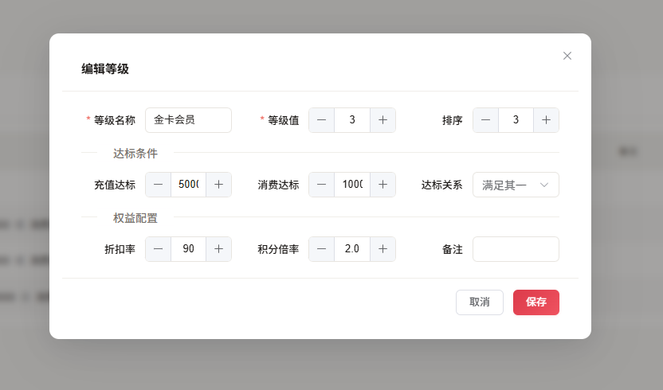
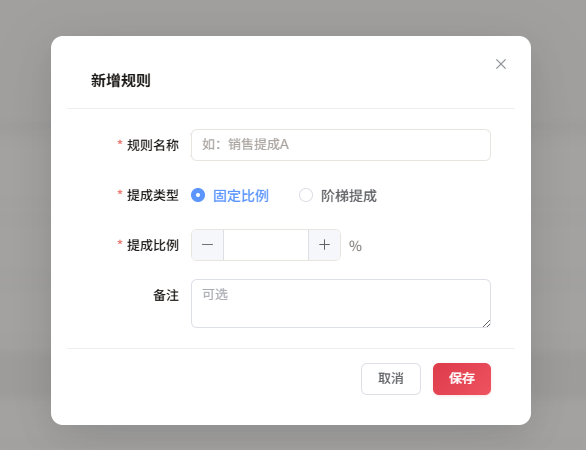

# 仓储脉搏 — 仓库管理系统

前后端分离的仓库管理系统，支持 Web 端 + 移动端（uni-app X），适用于中小型仓库的进销存全链路管理。

## 项目简介

---

🎉 本系统是一款面向中小型仓库的进销存管理系统，覆盖采购入库、销售出库、散客零售、退货管理、库存盘点等核心业务全流程。

📊 首页数据看板实时展示商品总数、库存预警、今日进销概况等关键指标，快速掌握运营状态。

📈 内置进销金额、商品明细及利润分析三大报表，支持按今天、本周、本月、本季度、本年或自定义时间范围进行多维度查询与图表展示。

👥 会员体系支持会员注册、充值、消费、余额管理及等级规则配置，助力客户精细化运营。

🏆 绩效排名与店员提成管理，支持固定比例和阶梯式提成规则，自动计算月度提成。

📱 移动端基于 uni-app X 开发，支持微信小程序和 App，随时随地管理仓库。

🔐 完善的权限管理体系，支持用户、角色、部门、菜单、按钮级权限灵活配置。

🐳 提供 Docker 一键部署方案，开箱即用。

> **📢 免费开源声明**：本项目完全免费开源，任何人都可以自由使用、学习和修改，但**禁止直接出售本软件**。详见 [LICENSE](LICENSE) 文件。

## 💻 技术栈

| 端 | 技术                                                                             |
|---|--------------------------------------------------------------------------------|
| 🖥️ 后端 | Spring Boot 3.5.5 + Java 21 + MyBatis-Plus 3.5.5 + SA-Token 1.38.0 + MySQL 8.0 |
| 🌐 Web 前端 | Vue 3.5 + TypeScript + Element Plus 2.9 + ECharts 5.5 + Vite 6                 |
| 📱 移动端 | uni-app X + UTS + Vue 3（支持微信小程序 / App / H5）                                    |
| 🐳 部署 | Docker Compose + Nginx + MySQL                                                 |

## 🎯 功能模块

### 🏠 首页看板
- 📦 商品总数、库存预警数、今日进货、今日销售统计卡片
- 📢 公告通知面板
- ⚠️ 库存预警商品列表
- 📝 最近操作日志

### ⚙️ 系统管理
- 👥 **用户管理**：用户增删改查、角色分配、密码管理、个人资料
- 🎭 **角色管理**：角色 CRUD、菜单权限分配
- 🏢 **部门管理**：树形部门结构管理
- 📋 **菜单管理**：菜单树、按钮权限配置
- 🔐 **权限管理**：RBAC 权限模型
- 📢 **公告管理**：系统公告发布与管理
- 📝 **登录日志**：登录行为审计
- 📋 **操作日志**：业务操作审计（基于 AOP 注解，支持按类型、模块、操作人、时间范围筛选）
- 🎨 **图标管理**：Element Plus 图标选择器

### 📦 基础数据
- 👤 **客户管理**：客户信息维护
- 🏭 **供应商管理**：供应商信息维护
- 📁 **商品分类**：商品分类树形管理
- 📦 **商品管理**：商品档案、图片上传、拼音自动生成、库存预警、上下架管理

### 📥 进货管理
- 🛒 **POS 进货**：收银台风格批量进货
- 📋 **进货订单**：按订单号分组管理，支持整单退货、单品退货、追加商品
- 📝 **退加货记录**：进货退货与追货历史记录

### 📤 销售管理
- 🛒 **POS 销售**：收银台风格批量销售
- 📋 **销售订单**：按订单号分组管理，支持整单退货、单品退货、追加商品
- ↩️ **销售退货**：销售退货处理
- 📝 **退加货记录**：销售退货与追货历史记录

### 🛒 散客零售
- 🛒 **POS 零售**：散客快速收银
- 📋 **零售订单**：订单管理与退货
- ↩️ **零售退货**：散客退货处理
- 📝 **退加货记录**：零售退货与追货历史记录

### 📊 报表统计
- 💰 **进销金额分析**：按时间段统计进货/销售金额趋势（柱状图）
- 📦 **进销商品分析**：按时间段统计商品明细（柱状图 + 表格，支持分页）
- 💹 **利润分析**：按时间段对比销售额、进货成本，计算毛利润和毛利率（柱状图 + 折线图）
- 📅 所有报表支持：今天、昨天、本周、本月、本季、本年、自定义日期范围

### 📋 库存盘点
- 📝 **盘点管理**：创建盘点单、录入实盘数量、系统数量自动比对
- ✅ 盘点提交后自动更新库存

### 👥 会员中心
- 📇 **会员管理**：会员注册、手机号/卡号/姓名查询、充值、消费、余额管理
- 🏅 **等级规则**：会员等级配置（按消费金额自动升级）

### 🏆 绩效管理
- 📊 **业绩排名**：销售员业绩排名（按金额）、商品销量排名（按数量），支持时间段筛选
- 💰 **店员提成**：提成规则配置（固定比例 + 阶梯式提成）、月度提成自动计算、提成确认发放
- 📝 **我的提成**：员工个人提成查询

## 📱 移动端（uni-app X）

基于 uni-app X 框架开发的移动端应用，支持微信小程序和 App，覆盖 Web 端核心功能：

| 模块 | 功能 |
|---|---|
| 🏠 工作台 | 首页数据看板 |
| 📦 商品 | 商品列表、商品详情 |
| 📥 进货 | POS 进货、进货订单、退加货记录 |
| 📤 销售 | POS 销售、销售订单、退加货记录 |
| 🛒 零售 | POS 零售、零售订单、退加货记录 |
| 📋 盘点 | 盘点管理、盘点录入 |
| 👥 会员 | 会员列表、等级规则 |
| 📊 报表 | 进销分析报表 |
| 🏆 绩效 | 业绩排名、店员提成、我的提成 |
| ⚙️ 系统 | 用户/角色/部门/菜单/权限管理、公告、日志 |

## 🖼️ 功能截图

### 登录页 & 首页

| 登录 | 首页 |
|:---:|:---:|
|  |  |

### 系统管理

| 系统管理 | 界面布局 |
|:---:|:---:|
|  |  |

### 人资中心

| 人员管理 | 角色管理 | 部门管理 |
|:---:|:---:|:---:|
|  |  |  |

### 基础数据

| 客户管理 | 供应商管理 | 商品分类 | 商品管理 |
|:---:|:---:|:---:|:---:|
|  |  |  |  |

### 进货管理

| 商品进货 | 进货订单 | 订单详情 | 退加货记录 |
|:---:|:---:|:---:|:---:|
|  |  |  |  |

| 进货订单-加货 | 进货订单-退货 | 盘点管理 | 盘点录入 |
|:---:|:---:|:---:|:---:|
|  |  |  |  |

### 销售管理

| 商品销售 |
|:---:|
|  |

### 散客零售

| 零售管理 |
|:---:|
|  |

### 会员中心

| 会员列表 | 等级规则 | 等级设置 |
|:---:|:---:|:---:|
|  |  |  |

### 报表统计

| 进销金额分析 | 进销商品分析 | 利润分析 |
|:---:|:---:|:---:|
|  |  |  |

### 绩效管理

| 绩效排名 | 我的提成 | 提成规则 | 提成记录 |
|:---:|:---:|:---:|:---:|
|  |  |  |  |

| 提成记录设置 | 计算提成 |
|:---:|:---:|
|  |  |

## 🔑 默认账号

| 用户名 | 密码 | 角色 |
|---|---|---|
| admin | 123456 | 超级管理员 |

## 🚀 快速开始

### 📋 环境要求

| 依赖 | 版本 |
|---|---|
| ☕ JDK | 21+ |
| 📦 Maven | 3.6+ |
| 🗄️ MySQL | 8.0+ |
| 🟢 Node.js | 16+ |

### 🗄️ 数据库初始化

```bash
mysql -u root -p
CREATE DATABASE warehouse DEFAULT CHARACTER SET utf8mb4 COLLATE utf8mb4_general_ci;
EXIT;
mysql -u root -p warehouse < warehouse.sql
```

### 🖥️ 后端启动

```bash
cd warehouse-back
mvn clean package
mvn spring-boot:run
# 或
java -jar target/warehouse-1.3.0-SNAPSHOT.jar
```

后端运行在 `http://localhost:8888`，Swagger API 文档：`http://localhost:8888/swagger-ui/index.html`

### 🌐 Web 前端启动

```bash
cd warehouse-frontend
npm install
npm run dev
```

前端运行在 `http://localhost:5173`，自动代理 `/api/*` 到后端。

### 📱 移动端启动

使用 HBuilderX 打开 `uniappx/` 目录，运行到微信小程序或 App。

### 📦 生产构建

```bash
cd warehouse-frontend
npm run build
# 产物在 warehouse-frontend/dist/
```

## 🐳 Docker 部署

所有 Docker 配置集中在 `docker/` 目录，数据挂载到宿主机，方便持久化和随时修改配置。

### 目录结构

```
docker/
├── docker-compose.yml      # 容器编排
├── .env                    # 数据挂载根目录配置
├── .env.example            # 环境变量模板
├── backend/Dockerfile      # 后端多阶段构建
├── web/Dockerfile          # 前端+Nginx 合并构建
└── nginx/                  # Nginx 配置模板
```

### 首次部署

```bash
# 1. 进入目录
cd docker

# 2. 按需修改 .env（默认 DATA_ROOT=D:/dockerData）
vim .env

# 3. 创建数据目录（Windows 会自动创建，Linux/macOS 需手动）
mkdir -p D:/dockerData/mysql D:/dockerData/warehouse-nginx D:/dockerData/warehouse/back

# 4. 启动全部服务（配置文件首次会自动从镜像模板复制到挂载目录）
docker compose up -d --build
```

访问：
- 🌐 前端：`http://localhost:8888`
- 🔌 后端 API：`http://localhost:8888/api/...`
- 🗄️ MySQL：`localhost:3306`（root/123456）

### 更新部署（改代码后）

```bash
cd docker

# 前后端都改了
docker compose up -d --build

# 只改后端
docker compose up -d --build backend

# 只改前端
docker compose up -d --build web
```

### 常用运维

```bash
# 查看日志
docker compose logs -f

# 停止全部
docker compose down

# 完全重建（清空数据库）
docker compose down
rm -rf D:/dockerData/mysql/*
docker compose up -d --build

# 备份数据库
docker compose exec mysql mysqldump -uroot -p123456 warehouse > backup.sql
```

## 📂 项目结构

```
warehouse/
├── warehouse-back/             # 后端 Spring Boot 项目
│   └── src/main/java/com/sunlee/
│       ├── sys/                # 系统模块（用户、角色、部门、菜单、日志等）
│       └── bus/                # 业务模块（客户、供应商、商品、进销存、会员等）
├── warehouse-frontend/         # Web 前端 Vue 3 项目
│   └── src/
│       ├── api/                # API 接口层
│       ├── views/              # 页面组件（53 个页面）
│       ├── components/         # 通用组件
│       ├── stores/             # Pinia 状态管理
│       ├── router/             # 路由配置
│       └── composables/        # 组合式函数
├── uniappx/                    # 移动端 uni-app X 项目
│   ├── pages/                  # 页面（40+ 页面）
│   ├── api/                    # API 接口层
│   ├── components/             # 通用组件
│   └── stores/                 # 状态管理
├── docker/                     # Docker 部署配置
├── warehouse.sql               # 数据库初始化脚本
└── img/                        # 功能截图
```

## 🔌 API 文档

启动后端后访问 Swagger UI：`http://localhost:8888/swagger-ui/index.html`

包含 25 个 Controller、200+ 接口的完整文档，支持在线调试。

## 📄 许可证

本项目采用 MIT 许可证，详见 [LICENSE](LICENSE) 文件。

**使用说明：**
- ✅ **免费使用**：任何人可以免费使用本软件
- ✅ **学习研究**：可用于学习、研究和个人项目
- ✅ **修改使用**：允许自行修改后使用
- ❌ **禁止出售**：不得将本软件（包括修改版本）直接作为商品出售

欢迎 Star、Fork 和提交 Pull Request！

## 📝 更新记录

### v1.3.0 (2026-06-09)
- ✨ 新增库存盘点管理，支持盘点单创建、实盘录入、库存自动更新
- ✨ 新增会员中心，支持会员注册、充值、消费、余额管理及等级规则
- ✨ 新增绩效排名，支持销售员业绩排名和商品销量排名
- ✨ 新增店员提成管理，支持固定比例和阶梯式提成规则、月度提成计算
- ✨ 新增操作日志审计，基于 AOP 注解自动记录业务操作
- ✨ 新增移动端（uni-app X），支持微信小程序和 App
- ✨ 新增 Docker 一键部署方案
- ✨ 新增 Swagger API 文档
- 🔧 后端认证从 Shiro 迁移到 SA-Token
- 🐛 修复已知问题

### v1.2.0 (2026-05-28)
- ✨ 新增散客零售功能，支持散客商品销售
- ✨ 新增散客退货功能，支持散客商品退货

### v1.1.0 (2026-05-20)
- ✨ 新增商品自定义属性，支持模糊搜索
- ✨ 新增报表统计模块：进销金额分析、进销商品分析、利润分析
- ✨ 报表支持多时间维度查询：今天、昨天、本周、本月、本季、本年、自定义日期范围
- 🐛 修复已知问题
