# 仓库管理系统

前后端分离的仓库管理系统，适用于小型仓库的进销存管理。

## 项目简介

---

🎉 本系统是一款面向小型仓库的进销存管理系统，帮助仓库人员高效完成采购入库、销售出库、退货及库存查询等核心业务。

📊 首页数据看板实时展示商品总数、库存预警、今日进销概况等关键指标，快速掌握运营状态。

✨ 系统支持客户、供应商、商品分类及档案管理，完整覆盖进货、进货退货、销售、销售退货全流程。

📈 内置进销金额、商品及利润三大分析报表，支持按今天、本周、本月、本季度、本年或自定义时间范围进行多维度查询与图表展示。

🔐 同时具备完善的权限管理功能，支持用户、角色、部门、菜单灵活配置。

🚀 采用主流技术架构开发，具备良好的可维护性与可扩展性。

> **📢 免费开源声明**：本项目完全免费开源，任何人都可以自由使用、学习和修改，但**禁止直接出售本软件**。详见 [LICENSE](LICENSE) 文件。

## 💻 技术栈

| 端 | 技术 |
|---|---|
| 🖥️ 后端 | Spring Boot 3.5.5 + Java 21 + MyBatis-Plus + SA-Token + MySQL |
| 🌐 前端 | Vue 3 + TypeScript + Element Plus + Vite + ECharts |

## 🎯 功能模块

### ⚙️ 系统管理
- 👥 用户管理、角色管理、部门管理
- 📋 菜单管理、权限管理（RBAC）
- 📢 公告管理、登录日志、缓存管理
- 👤 个人信息、修改密码

### 📦 业务管理
- **📁 基础数据**：客户管理、供应商管理、商品分类、商品管理
- **📥 进货管理**：商品入库，记录进货价格、数量、供应商
- **↩️ 退货管理**：进货退货
- **📤 销售管理**：商品出库，记录销售价格、数量、客户
- **🔄 销售退货**：销售退货

### 📊 报表统计
- **💰 进销金额分析**：按时间段统计进货/销售金额趋势（柱状图）
- **📦 进销商品分析**：按时间段统计商品明细（柱状图 + 表格，支持分页）
- **💹 利润分析**：按时间段对比销售额、进货成本，计算毛利润和毛利率（柱状图 + 折线图）
- 📅 所有报表支持：今天、昨天、本周、本月、本季、本年、自定义日期范围

### 🏠 首页看板
- 📦 商品总数、库存预警数、今日进货、今日销售
- 📝 最近操作日志
- ⚠️ 库存预警商品列表

## 🔑 默认账号

| 用户名 | 密码 | 角色 |
|---|---|---|
| admin | 123456 | 超级管理员 |

## 📸 功能截图
### 🏠 登录页


### 🏠 首页
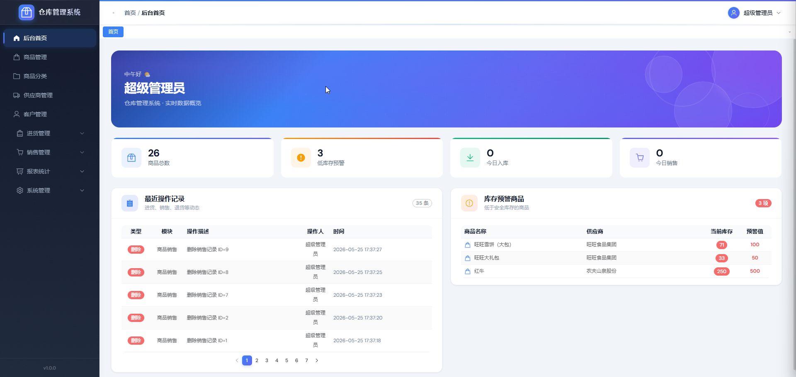

### ⚙️ 系统管理
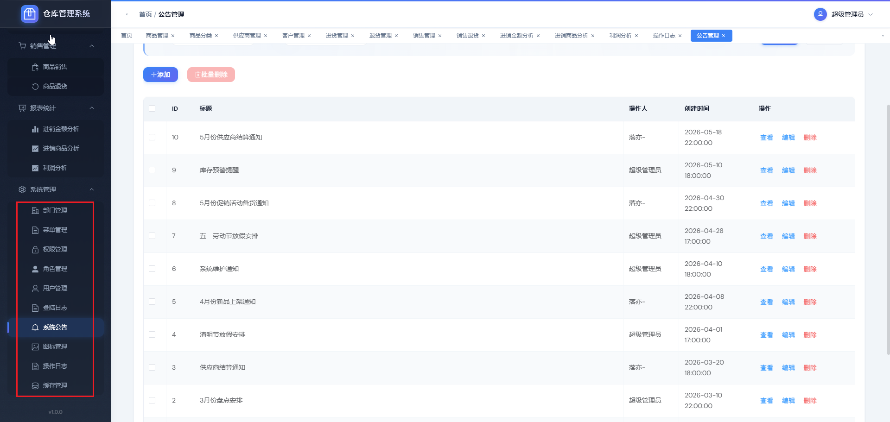

### 📁 基础数据管理
| 客户管理 | 供应商管理 |
|:---:|:---:|
| 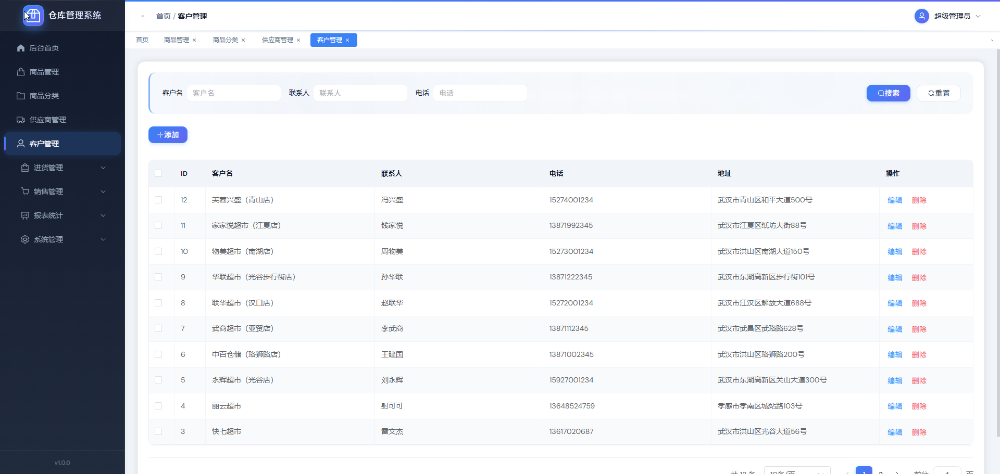 | 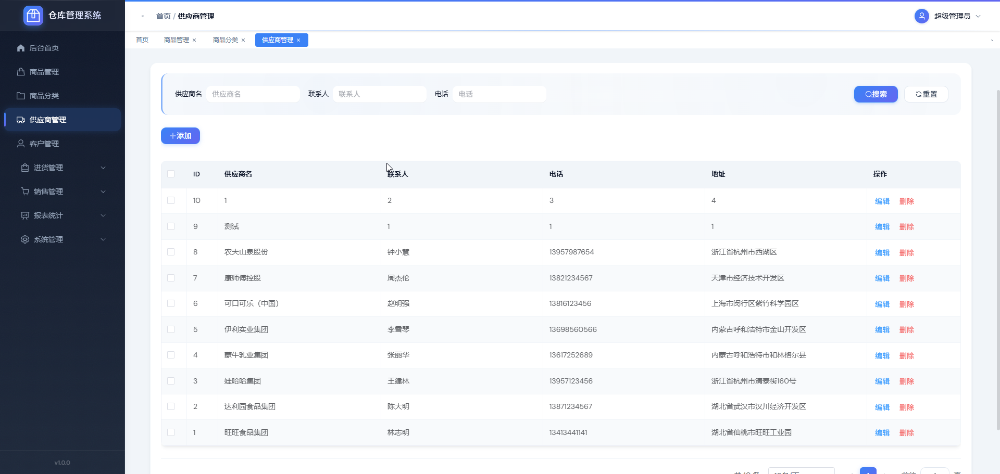 |

| 商品分类 | 商品管理 |
|:---:|:---:|
| 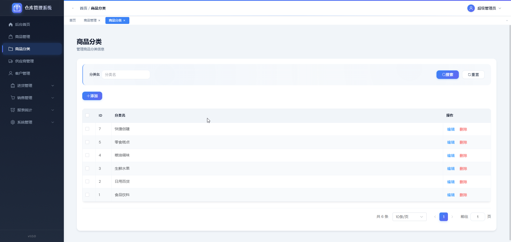 | 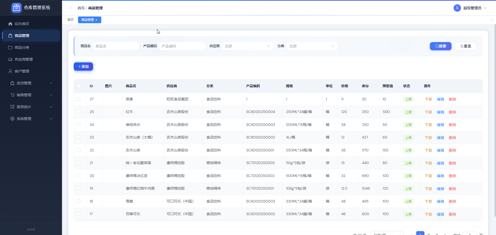 |

### 📥 进货管理
| 商品进货 | 商品退货 |
|:---:|:---:|
| 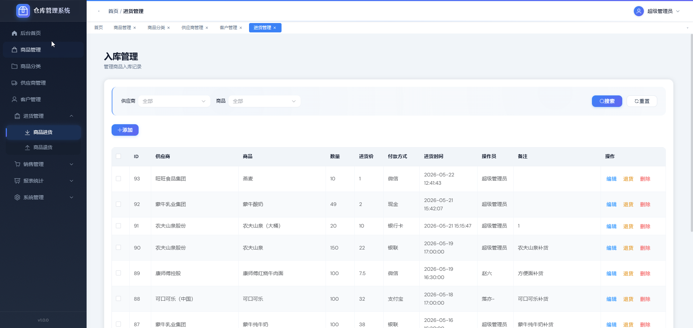 | 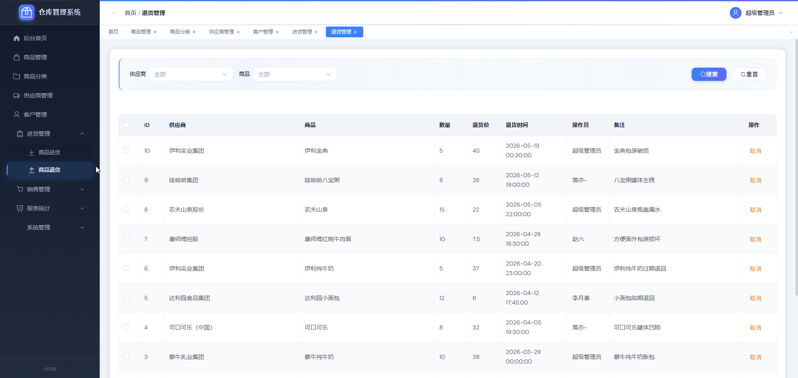 |

### 📤 销售管理
| 商品销售 | 商品退货 |
|:---:|:---:|
| 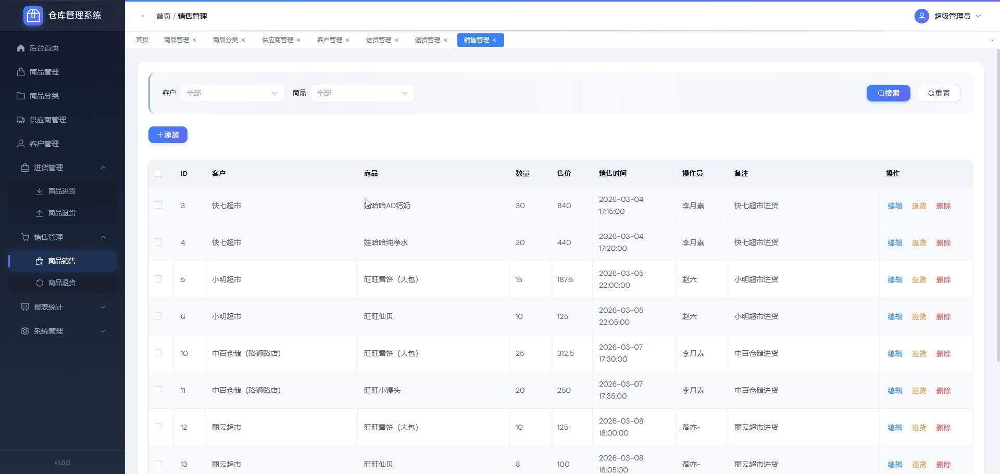 | 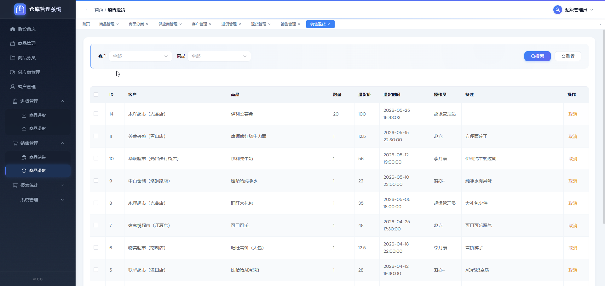 |

### 📊 报表统计
| 进销金额分析 | 进销商品分析 | 利润分析 |
|:---:|:---:|:---:|
| 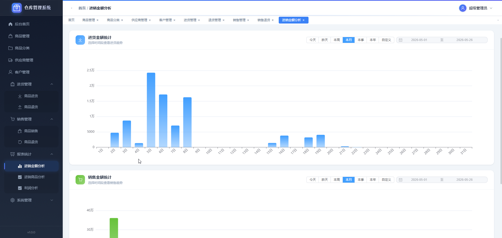 | 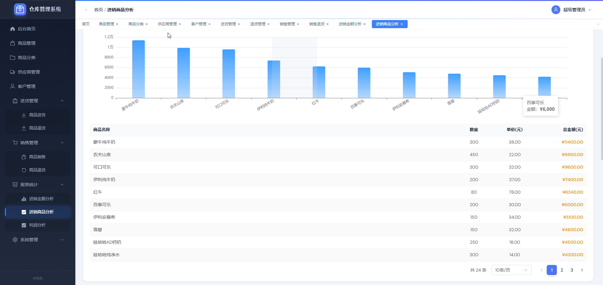 | 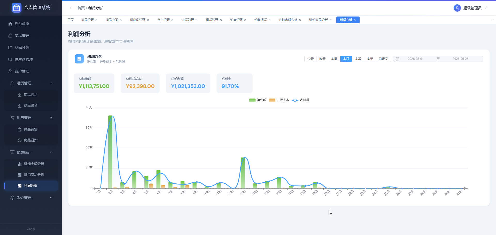 |

### 🛒 散客零售
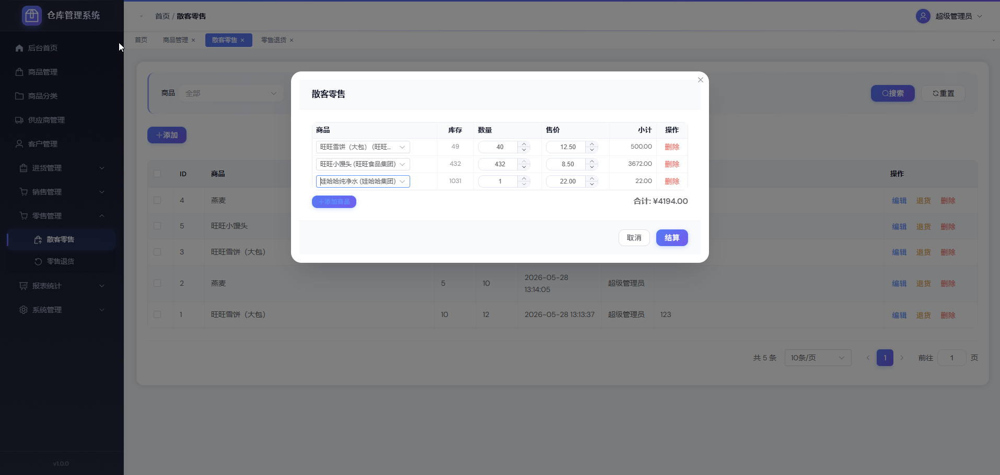

## 🚀 快速开始

### 📋 环境要求
- ☕ JDK 21+
- 📦 Maven 3.6+
- 🗄️ MySQL 5.7+
- 🟢 Node.js 16+

### 🗄️ 数据库初始化
```bash
mysql -u root -p
CREATE DATABASE warehouse DEFAULT CHARACTER SET utf8 COLLATE utf8_general_ci;
EXIT;
mysql -u root -p warehouse < warehouse.sql
```

### 🖥️ 后端启动
```bash
mvn clean package
mvn spring-boot:run
# 或
java -jar target/warehouse-0.0.1-SNAPSHOT.jar
```
后端运行在 `http://localhost:8888`

### 🌐 前端启动
```bash
cd warehouse-frontend
npm install
npm run dev
```
前端运行在 `http://localhost:8888`，自动代理 `/api/*` 到后端。

### 📦 生产构建
```bash
cd warehouse-frontend
npm run build
# 产物在 warehouse-frontend/dist/
```

## 🐳 Docker 部署

所有 Docker 配置集中在 `docker/` 目录，数据挂载到宿主机，方便持久化和随时修改配置。

### 目录结构

```
docker/
├── docker-compose.yml      # 容器编排
├── .env                    # 数据挂载根目录配置
├── .env.example            # 环境变量模板
├── backend/Dockerfile      # 后端多阶段构建
├── web/Dockerfile          # 前端+Nginx 合并构建
└── nginx/                  # Nginx 配置模板

sql/
└── warehouse.sql           # 数据库初始化脚本
```

### 首次部署

```bash
# 1. 打开目录
cd docker

# 2. 按需修改 .env（默认 DATA_ROOT=D:/dockerData）
vim .env

# 3. 创建数据目录（Windows 会自动创建，Linux/macOS 需手动）
mkdir -p D:/dockerData/mysql D:/dockerData/warehouse-nginx D:/dockerData/warehouse/back

# 4. 启动全部服务（配置文件首次会自动从镜像模板复制到挂载目录）
docker compose up -d --build
```

访问：
- 前端：`http://localhost:8888`
- 后端 API：`http://localhost:8888/api/...`
- MySQL：`localhost:3306`（root/123456）

### 更新部署（改代码后）

```bash
cd docker

# 前后端都改了
docker compose up -d --build

# 只改后端
docker compose up -d --build backend

# 只改前端
docker compose up -d --build web
```

> 后端 Dockerfile 使用 `warehouse-*.jar` 通配符，改 `pom.xml` 版本号后无需修改 Dockerfile。

### 修改配置

后端配置走外部挂载文件，改完重启生效：

```bash
# 编辑 D:/dockerData/warehouse/back/application-pro.yml
# 然后重启后端
docker compose restart backend
```

Nginx 配置修改后无需重启容器：

```bash
docker compose exec web nginx -s reload
```

> 首次部署时，如果 `D:/dockerData/warehouse-nginx/` 下没有 `nginx.conf`，容器启动会自动从镜像内置模板复制。后续修改直接编辑宿主机目录里的文件即可。

### 常用运维

```bash
# 查看日志
docker compose logs -f

# 查看单个服务日志
docker compose logs -f backend

# 停止全部
docker compose down

# 完全重建（清空数据库）
docker compose down
rm -rf D:/dockerData/mysql/*
docker compose up -d --build

# 备份数据库
docker compose exec mysql mysqldump -uroot -p123456 warehouse > backup.sql
```

## 📄 许可证

本项目采用 MIT 许可证，详见 [LICENSE](LICENSE) 文件。

**使用说明：**
- ✅ **免费使用**：任何人可以免费使用本软件
- ✅ **学习研究**：可用于学习、研究和个人项目
- ✅ **修改使用**：允许自行修改后使用
- ❌ **禁止出售**：不得将本软件（包括修改版本）直接作为商品出售

欢迎 Star、Fork 和提交 Pull Request！

## 📝 更新记录

### v1.2.0 (2026-05-28)
- ✨ 新增散客零售功能，支持散客商品销售
- ✨ 新增散客退货功能，支持散客商品退货

### v1.1.0 (2026-05-20)
- ✨ 新增商品自定义属性，支持模糊搜索
- ✨ 新增报表统计模块：进销金额分析、进销商品分析、利润分析
- ✨ 报表支持多时间维度查询：今天、昨天、本周、本月、本季、本年、自定义日期范围
- 🐛 修复已知问题
